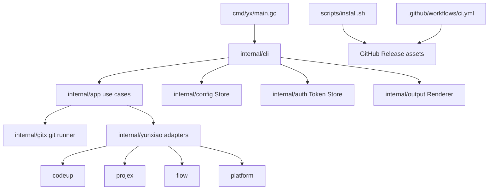

# Linux Support Implementation Plan

## Executive Summary

`yx-cli` is already structurally close to Linux-ready because the command implementation is pure Go, uses Cobra for CLI composition, persists config under the user's home directory, and shells out only to `git` for repository operations. The missing Linux work was concentrated in the release and installation surface:

- `scripts/install.sh` rejected every OS except Darwin.
- `.github/workflows/ci.yml` released only `yx-darwin-arm64` and `yx-windows-amd64.exe`.
- `scripts/test_install.sh` only asserted Darwin asset download URLs.
- `README.md` did not document Linux/Ubuntu installation or Linux release assets.

This document records the architecture review and the concrete implementation needed to make Linux, at minimum Ubuntu, a supported platform.

## Current Architecture Map



## Platform-Relevant Findings

| Area | Evidence | Linux Impact |
|---|---|---|
| Runtime language | `go.mod` uses Go `1.26.3`; direct deps are `cobra` and `yaml.v3`. | Cross-compilation is straightforward; no cgo dependency found. |
| Entrypoint | `cmd/yx/main.go` only constructs `cli.NewRootCommand()` and exits with stderr on error. | Portable across Linux. |
| Config path | `internal/cli/config.go` defaults to `$HOME/.config/yx/config.yaml`. | Aligns with Linux conventions. |
| Config/token writes | `internal/config/store.go` and `internal/auth/file_store.go` create dirs with `0700`, temp files with `0600`, then atomic rename. | POSIX-friendly and appropriate for Ubuntu. |
| External binary | `internal/gitx/*.go` shells out to `git`. | Ubuntu package requirement: `git` is needed for clone/current-repo flows. Other API-only commands do not need it. |
| Installer | `scripts/install.sh` used `uname -s`/`uname -m`, but only accepted `darwin` and `arm64/aarch64`. | Main blocker for Ubuntu. |
| Release workflow | `.github/workflows/ci.yml` built Darwin arm64 and Windows amd64 on tag pushes. | Needed Linux assets. |

## Implemented Minimal Support

The minimal Ubuntu-ready implementation is:

1. Accept Linux in `scripts/install.sh`.
2. Normalize common Linux architectures:
   - `x86_64` and `amd64` -> `amd64`
   - `aarch64` and `arm64` -> `arm64`
3. Publish `yx-linux-amd64` and `yx-linux-arm64` from GitHub Actions tag releases.
4. Extend installer tests so the URL contract covers Linux assets and real `uname` detection behavior.
5. Document Linux assets and Ubuntu prerequisites in `README.md`.

## File-Level Implementation Details

### `scripts/install.sh`

Update `detect_asset()` so Ubuntu maps to the new release asset names:

```sh
case "$os" in
darwin) os="darwin" ;;
linux) os="linux" ;;
*) printf 'yx install: unsupported OS: %s\n' "$os" >&2; exit 1 ;;
esac

case "$arch" in
x86_64|amd64) arch="amd64" ;;
arm64|aarch64) arch="arm64" ;;
*) printf 'yx install: unsupported architecture: %s\n' "$arch" >&2; exit 1 ;;
esac
```

Resulting asset names:

- Ubuntu x86_64: `yx-linux-amd64`
- Ubuntu arm64/aarch64: `yx-linux-arm64`
- macOS Apple Silicon: `yx-darwin-arm64`

### `.github/workflows/ci.yml`

Add Linux targets to the release build matrix:

```yaml
- name: linux-amd64
  goos: linux
  goarch: amd64
  output: yx-linux-amd64
- name: linux-arm64
  goos: linux
  goarch: arm64
  output: yx-linux-arm64
```

Because the project has no cgo dependency, no extra compiler or sysroot setup is required.

### `scripts/test_install.sh`

The test suite should verify two contracts:

1. Explicit `YX_INSTALL_ASSET` still downloads the expected latest and pinned-release URLs.
2. Fake `uname -s`/`uname -m` output maps Linux x86_64/aarch64 to the intended asset names.

This prevents future changes from accidentally breaking Ubuntu installation while keeping the test fully local and network-free.

### `README.md`

Document:

- The installer supports macOS arm64, Linux amd64, and Linux arm64.
- Ubuntu users can use the same curl installer.
- Release assets now include `yx-linux-amd64` and `yx-linux-arm64`.

## Ubuntu User Experience

Target command:

```bash
sudo apt-get update
sudo apt-get install -y curl git
curl -fsSL https://raw.githubusercontent.com/AldenWangExis/yx-cli/main/scripts/install.sh | sh
yx --version
yx auth status
```

Notes:

- `curl` is required by the installer.
- `git` is required for `yx repo clone` and `yx repo current`.
- The installer writes to `$HOME/.local/bin/yx`.
- If `$HOME/.local/bin` is not on `PATH`, the installer appends the appropriate export to `.bashrc`, `.zshrc`, or `.profile`.

## Verification Strategy

Local verification:

```bash
sh scripts/test_install.sh
GOOS=linux GOARCH=amd64 go build -trimpath -o /tmp/yx-linux-amd64 ./cmd/yx
GOOS=linux GOARCH=arm64 go build -trimpath -o /tmp/yx-linux-arm64 ./cmd/yx
go test ./...
```

CI verification:

- Pull requests and pushes to `main` run `go test ./...` on `ubuntu-latest`.
- Tag pushes run tests, build all release assets, upload artifacts, and create/update the GitHub Release.

Optional stronger release gate:

```yaml
- name: Smoke test Linux amd64 binary
  if: matrix.goos == 'linux' && matrix.goarch == 'amd64'
  run: dist/yx-linux-amd64 --version
```

The arm64 Linux binary cannot be executed directly on `ubuntu-latest` without emulation, so build success is the cheap default gate.

## Risks And Follow-Ups

| Risk | Severity | Recommendation |
|---|---:|---|
| No checksum files are published. | Medium | Generate `checksums.txt` in the release job and document `sha256sum -c`. |
| No Linux packaging format exists. | Low initially | Start with direct binary install; add `.deb` only if enterprise distribution or uninstall semantics become important. |
| Installer mutates shell profiles. | Low | Current behavior is acceptable; for stricter automation add `YX_INSTALL_NO_PATH_UPDATE=1`. |
| Git dependency is implicit. | Low | README now calls it out; optionally add runtime diagnostics before git-backed commands. |
| Windows asset is documented but installer still targets POSIX shells only. | Low | Keep Windows as manual download unless a PowerShell installer is needed. |

## Recommended Roadmap

### Phase 1: Ubuntu Binary Support

Status: implemented in this branch.

- Linux asset detection in installer.
- Linux release assets in CI.
- Installer tests for Linux asset names.
- README installation/release documentation.

### Phase 2: Release Integrity

Add SHA-256 checksums and publish them with every tag:

```sh
cd dist
sha256sum yx-* > checksums.txt
```

Then upload `checksums.txt` with the binaries.

### Phase 3: Linux Smoke Testing

Run the Linux amd64 asset after build:

```sh
dist/yx-linux-amd64 --version
dist/yx-linux-amd64 --help
```

For arm64, either rely on cross-build success or add QEMU only if release confidence demands it.

### Phase 4: Optional Debian Package

Only add a `.deb` after direct binary installation has proven insufficient. A Debian package would give:

- `/usr/local/bin` or `/usr/bin` placement.
- Package manager uninstall/upgrade flow.
- Metadata for internal mirrors.

This is not required for the current "Ubuntu can use it" target.

## Definition Of Done

- `curl .../install.sh | sh` works on Ubuntu x86_64.
- The latest GitHub Release contains `yx-linux-amd64`.
- `YX_INSTALL_VERSION=<tag>` downloads the matching pinned Linux asset.
- `yx --version`, `yx --help`, `yx auth status`, and API-only list/view commands execute on Ubuntu.
- `yx repo current` and `yx repo clone` work when `git` is installed.
